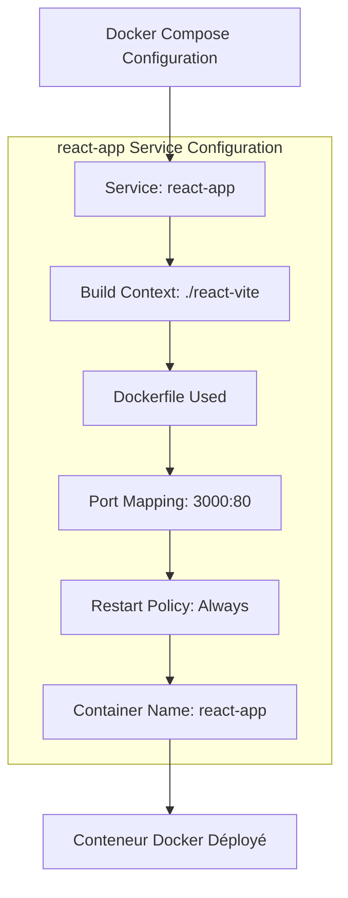

# Docker Compose Workflow

```mermaid
flowchart TD
    A["Docker Compose Configuration"] --> B["Service: react-app"]

    subgraph "react-app Service Configuration"
    B --> C["Build Context: ./react-vite"]
    C --> D["Dockerfile Used"]
    D --> E["Port Mapping: 3000:80"]
    E --> F["Restart Policy: Always"]
    F --> G["Container Name: react-app"]
    end

    G --> H["Conteneur Docker Déployé"]
```
