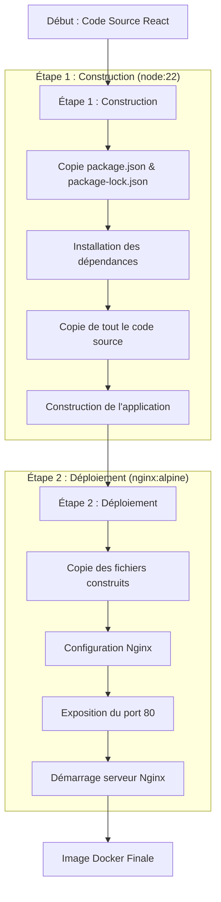

# Processus de Construction Docker pour une Application React

## Diagramme du Workflow

```mermaid
flowchart TD
    A["Début : Code Source React"] --> B["Étape 1 : Construction"]

    subgraph "Étape 1 : Construction (node:22)"
    B --> C["Copie package.json & package-lock.json"]
    C --> D["Installation des dépendances"]
    D --> E["Copie de tout le code source"]
    E --> F["Construction de l'application"]
    end

    F --> G["Étape 2 : Déploiement"]

    subgraph "Étape 2 : Déploiement (nginx:alpine)"
    G --> H["Copie des fichiers construits"]
    H --> I["Configuration Nginx"]
    I --> J["Exposition du port 80"]
    J --> K["Démarrage serveur Nginx"]
    end

    K --> L["Image Docker Finale"]
```
